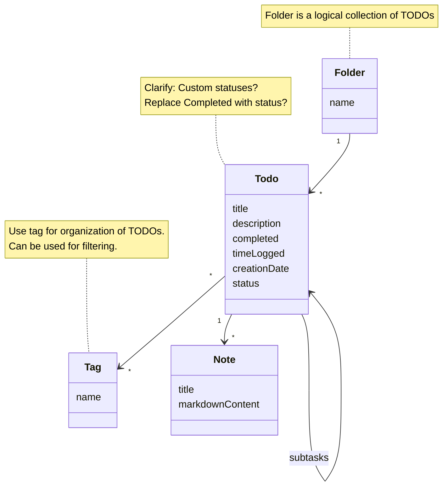

# Yet Another TODO App

## Domain 

```mermaid
classDiagram
    Folder "1" --> "*" Todo
    Todo --> "*" Todo: subtasks
    Todo "*" --> "*" Tag
    Todo "1" --> "*" Note
    note for Todo "Clarify: Custom statuses? 
    Replace Completed with status?"
    class Todo {
        title
        description
        completed
        timeLogged
        creationDate
        status
    }

    note for Folder "Folder is a logical collection of TODOs"
    class Folder {
        name
    }

    note for Tag "Use tag for organization of TODOs.
     Can be used for filtering."
    class Tag {
        name
    }

    class Note {
        title
        markdownContent
    }
```